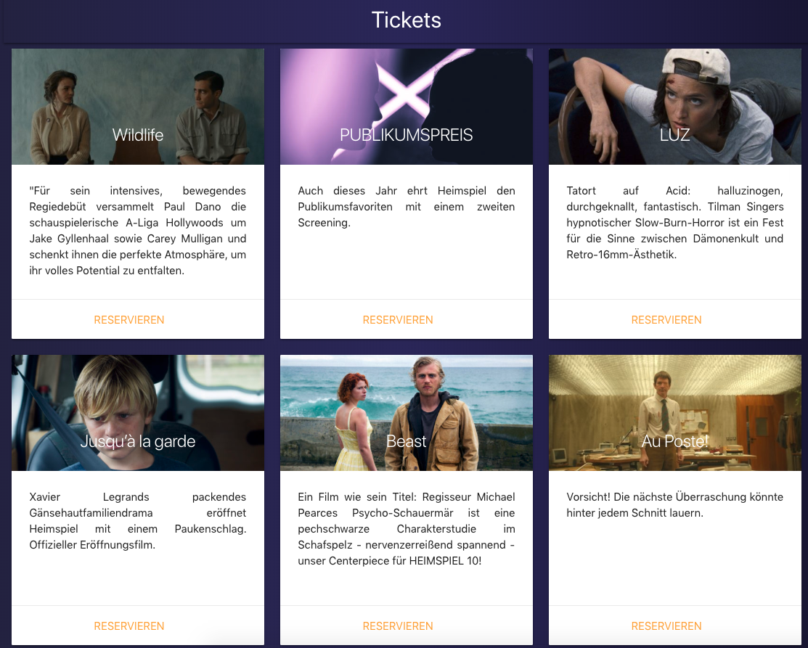

# HEIMSPIEL 10 Reservierung

An application to reserve tickets for the HEIMSPIEL 10 Filmfestival. This project was implemented in a very short timespan and used Firebase for backend functionality. The web app worked flawlessly during the week of HEIMSPIEL 10 with more than 500 reservations.

## Screenshot: 

## License

The code in this project is released under the [MIT license](LICENSE).
